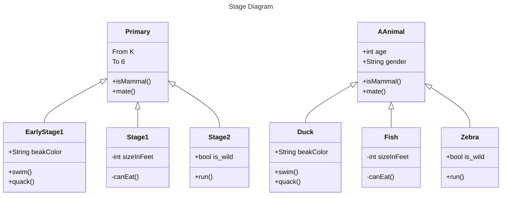

# Project - gurukul
Rishu's Home Education Initiative  

Undertaking Home Education(Rishu) in NSW, Australia - **NESA**(NSW Education standards Authority) - LandA(**Darug Land**)  

**Gurukul** is the name given to Rishu's Home Education Initiative. 

Content(s) of this repo is being pushed using **Github Desktop**

**What is the difference between a syllabus and the curriculum?**

Each syllabus includes the rationnale, aim, outcomes, course, specific content, and any mandated assessment requirements. After receiving the syllabus from NESA schools, then use this to develop the curriculu. The curriculum is a plan for learning that every school develops for each key learning area.

**Transcript of What is curriculum?**

Have you ever wondered what the difference is between a syllabus and the curriculum?

A syllabus is a mandated document produced by NESA to inform teachers of what they're required to teach students and why.

Each syllabus includes the rationale, aim, outcomes, course, specific content, and any mandated assessment requirements.

After receiving the syllabus from NESA schools, then use this to develop the curriculum.

The curriculum is a plan for learning that every school develops for each key learning area. It includes all relevant syllabuses and other relevant information to support teachers, including department policies and procedures. School priorities.

How the content is planned to be taught and the resources chosen. The curriculum provides an opportunity for teachers to plan, evaluate and modify teaching programs to improve student learning.

The curriculum: A plan for learning that includes the syllabus. For more information, visit the department's curriculum web page.

**Who prepares NSW syllabus ?**

NESA (NSW Education Standards Authority)

**Source**

 
_https://education.nsw.gov.au/teaching-and-learning/curriculum/leading-curriculum-k-12/explaining-curriculum-pcc_
_https://www.facebook.com/groups/homeeducationnsw_

Primary(k - 6)
Secondary(7 - 10)
Senior(11 - 12)

# Flow Chart

Simple flow chart Sample

## Mermaid

